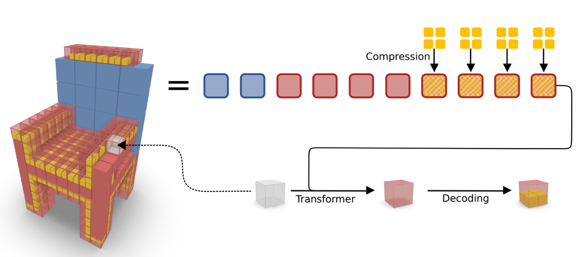

# Octree Transformer: Autoregressive 3D Shape Generation on Hierarchically Structured Sequences
Created by Moritz Ibing, Gregor Kobsik, Leif Kobbelt from RWTH Aachen University




The three stages of our network: (a) sequence compression (b) autoregressive generation with transformer (c) sequence decoding

## Introduction

This work is based on the paper [Octree Transformer: Autoregressive 3D Shape Generation on Hierarchically Structured Sequences](https://arxiv.org/abs/2103.03230).
Autoregressive models have proven to be very powerful in NLP text generation tasks and lately have gained popularity for image generation as well. However, they have seen limited use for the synthesis of 3D shapes so far. This is mainly due to the lack of a straightforward way to linearize 3D data as well as to scaling problems with the length of the resulting sequences when describing complex shapes. In this work we address both of these problems. We use octrees as a compact hierarchical shape representation that can be sequentialized by traversal ordering. Moreover, we introduce an adaptive compression scheme, that significantly reduces sequence lengths and thus enables their effective generation with a transformer, while still allowing fully autoregressive sampling and parallel training. 


## Getting Started

### Installation

To install the dependencies, run
 ```
pip install -r requirements.txt
 ```
### Data Set

 For the data set we refer to the [3D ShapeNet](https://www.shapenet.org/) data set. We used the [ShapeNetCore.v1](https://www.shapenet.org/download/shapenetcore) data set for our experiments. The data set can be stored in any directory. The path to the data set can be specified in the config file.

## Usage
### Training

To train the network, run
```
python main.py train --config <path to config file>
```
or to specify the essential hyperparameters as arguments, run e.g.
```
python main.py train --learning_rate 0.0003 --batch_size 2 --epochs 100 --dataset_path <path to data set>
```
### Sampling

To create samples generated by a trained model, run
```
python sample.py <path to model folder>
```
To create samples based on given context, run
```
python sample_conditional.py <path to model folder>
```

## ToDo's

 - [x] upload code
 - [x] create readme
 - [ ] add license
 - [ ] upload pretrained weights
 - [ ] create hands-on tutorial

## Citation

If you find our work useful, please cite our paper:
```
@misc{ibing2021octree,
      title={Octree Transformer: Autoregressive 3D Shape Generation on Hierarchically Structured Sequences}, 
      author={Moritz Ibing and Gregor Kobsik and Leif Kobbelt},
      year={2021},
      eprint={2111.12480},
      archivePrefix={arXiv},
      primaryClass={cs.CV}
}
```
